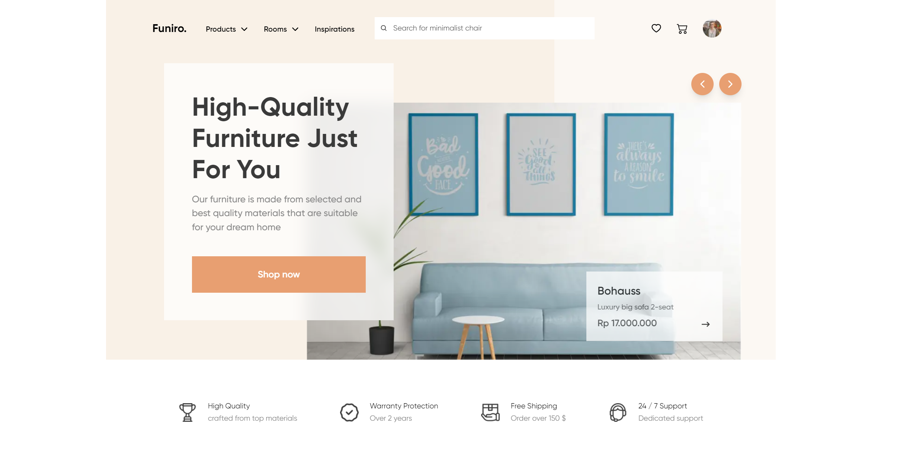

# Funiro

Funiro is an online store that offers a wide selection of home goods, making it easier for customers to find and purchase items that enhance their living spaces.




## Requirements

### Node

For development, you will only need Node.js installed on your environement.

```
npm install npm@latest -g
```

---

## Installation

1.  Clone the repository:

```
git clone https://github.com/Samstas/Funiro_test.git
```

1.  Navigate to the project directory:

```
cd funiro
```

3.  Install dependencies:

```
npm install
```

---

## Running the project

Once the dependencies are installed, you can start the project in development mode:

```
npm run dev
```

This will open the application in your browser, typically at http://localhost:3000.
